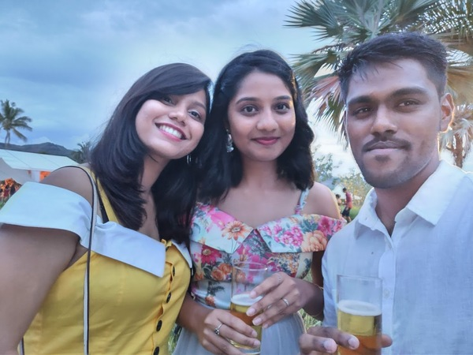

Now that 2022 is almost over, I decided to write about my experience so far in general. 

# University life
Electric with computer Science, yes it was an actual course at UOM(university of Mauritius) i took during my time at unviersity. I really didn’t enjoy my university life as much as I should have. I felt like during my entire 20s I was just trailing along, not really enjoying life, always resentful and regretful of my choices, and just wasting my time altogether. I didn’t even go on many holidays or trips anywhere. Most of my time was spent trying to rectify something that didn’t need to be. But I made some really good friends(which I hope they'll be lifelong friends). The only thing I'm really proud of acheiving is getting an A+ on my Dissertation. It would not have been possible without the help of my friend. We literally stayed sleepless nights just to complete it. My Dissertation was an Android app that can be used to detect any infringement on the road while you're driving. Feel free to contact me if you want more info, in any case here's my [research paper](https://link.springer.com/chapter/10.1007/978-3-030-90618-4_18).

Here's a picture of me holding my dissertaion(yes, this is my face. ugly? i know): 

# First Job

My first Job was at Ceridian as an Application Analyst. During that time, I actually had know idea on which career path to go to. You see, if you're a tech person, you know that the Tech world is huge, unfortunately for me I chose the first company that contacted me which was of course Ceridian. The job was basically like a Call-Center. I am sorry if you're from Ceridian reading this but I absolutely hated my job. It sucks even tho the salary was great for an entry level like me. See, Ceriian have an application called [DayForce](https://www.ceridian.com/products/dayforce), while the app is game changing in the HR world etc, my job was mainly to resovle issues that the clients faced. And yes, if you're guessing by now, I only worked on Dayforce. During the three months, I adapted rather quickly but the more I stayed at the job, the more I realized that I'm only learning the application for the company. I'm not actually learning anything, no new technologies. At one point, we were getting training on all sort of HR related stuffs. 

As I said in my previous blog, even tho I'm an introvert, I often like to listen to people, especially older people as I get to listen to their experience about their mistakes. So I did, I talked to the System Admin people there, who told me being in current job would get me nowthere if I'm someone who love to learn. Lukily during that time, they were hiring for the post of Configuration Mangement. But the mistake I made was telling my manager I hated the job. I know what you're thinking "Girish, why did you do that?" tbh, I don't know, I so hated my job that I wanted to quit asap. So, I told him, there is a opening for Configuration Mangement and I want to apply for it. So he did his best. I got an Interview, which was great, I was so hopefull that i would get it. After 1 week, did get it. Was told that I did not have enough experience for the job and did not have ccna too. That was my first encounter with depression, which hit me really hard. I was really down during these times, I was also getting pressured by the managed and HR. 

Before we continue, here's some happy memories I had at Ceridian.

This was during the eoy party with my two work buddies.

Another selfie, with my mentors who really helped me since day 1. Since he was a huge Game of Thrones fan, I gave him a [Game of Throne Msic Box](https://www.amazon.com/Thrones-Music-Musical-Carved-Wooden/dp/B07F3KNGG8) for Christmas for really helping, teaching and mentoring me. Always grateful for all the people that helped me.

Okay so last image. This was the team drunk af. I'm not actually sure how much I drunk that night but it was freaking crazy, best eoy party I've been to. I do remember the guys from the system admin team giving me Jack daniels to drink. yeah, crazy night. And Let's not forget the walk of shame when I went back to work. jk, I got a lot of praise. I'm someone who will actually forget about everything when i get on the dance floor. Get me drunk and get me on the dance floor, you sure will have a night you'll always remember xD

Let's get back to the boring stuff, shall we? After getting pressured by the manager, I started applying for other jobs. Eventually I landed an interview at sd worx as system admin. I did 3 interviews(2 technical ones and 1 HR). Another huge mistake I did at Ceridan was giving my resignation letter before I got another job. So yeah, this happened, I was so sure I'm going to get the job at Sd worx that I gave my resignation letter early. Yes, i did not get it and I was left with no job after I left Ceridian. To make thing worst, It was during that time, that Covid hit. 

# Depression time
For nearly 6 months, I was jobless. Full mode depression. I went through a lot of stuff during these periods, having nightmares everyday. It was aweful I must say. Especially since the lockdown. Staying at home, sleeping all day. There were times where I nearly gave up. I was full with negative thoughts. What kept me sane was anime/manga. I spend most of my times reading mangas/books. During these times also, I only stayed in contact with one friend(We didn't talked for nearly year, she was kind of an angel send from the sky to cheer me up) She was always supportive, always encouraging me not to give up. Also my parents always looking after me. And I did, I started to get back to shape. Started to look into my career seriously. I applied to a bunch of companies. Got a lot of rejections but never gave up. 

Eventually I got an Interview at Linkbynet. Lockdown periods was over, I went and did the technical interview. It was fun, I prepared a lot for this. They did asked me why I was unemployed, and I just told kept true to mysqlf and told them about my current situation, why I left the job at Ceridian, the stuff i'm having to go through. And three days later, I got the job as a Junior System Administrator. The only issue was that I had to wait another three months to start the job. So I did.

During these three months, I started preparing for my new job. I started learning Linux, System Administrator job. Since my friend was having some issues with her final year project, I helped her always remembering how she helped me during my worst time. 

One of the best achievement in my life was to assemble a team, a huge team of 23 people during Cyclone class 3 to go a play laser tag. Yes, I think it was a sunday I'm not sure, but yes 23 people during Cyclone class 3 was nearly an impossible task. Actually it was class 2 in the morning, we were still debating whether to go or not. Eventually we decided to go since the weather was fine. It was only during the ride on the bus we heard that it became class 3. I called Funzone(RIP now) immediately to make sure if it will still operate, and luckily it did. Since it was located at 4 bornes, we walked from Shoprite to 4 bornes. Yeah Yeah, Not only did i made them come play laser but also walked nearly 30 minutes during a Cyclone class 3. But hey, we had a lot of fun and  will be something we'll always remember. Here's the awesome team:

to be continued..

