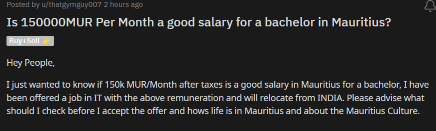

Mauritius Developers Conference 2022

This week, more than 900 tech enthusiasts descended on the city of Port Louis at [Caudan Arts Centre](https://caudanartscentre.com/) for the 7th Developers Conference. In case you are wondering what the Developers Conference is. Here is an article written by [Ish Sookun](https://twitter.com/IshSookun) on L'express [DEVCON](https://lexpress.mu/node/415580). 

Before we start talking about devcon, let's take a moment to appreciate the venue first. It was my first time being there for an event, and damn its beautiful. Unfortunately I did not take many photos but here is [tweet thread](https://twitter.com/AfriTheatreMag/status/1484796561884340225) I found on twitter. I can say I think it is absolutely remarkable. 

So, devcon over the course of 3 days, housing over 70+ sessions were able to welcome nearly 1000 attendees. The conference was free of charge for everyone. All that needed to be done was to go to their [website](https://conference.mscc.mu/agenda) and register. One of the reason I like going to these conferences, is for the GOODIES. This year we got a super cool t-shirt, stickers, card holder and a super cute duck. Oh did I mentioned that we also got free Wi-fi offered by Rogers Capital.

Unfortunately I missed the opening ceremony on the first day. There were some sessions I wanted to attend but couldn't. I attended "UNDERSTANDING THE UNDERLYING STACK OF LINUX CONTAINERS - IN JUST 5 MINS" by [Chittesh Sham](https://twitter.com/tesh1224). Super funny and great guy. His entrance was the hightlight of the session tbh. Okay so containers, while I'm still having troubles lately to understand containers, his talk was really helpful in some ways. Definitely going to make a post in the future once I get the grasp of it.
At 6pm, Happy Hour started which was sponsored by 2 companies (Spoon Consulting and forgot the second one). It was really fun, met my friends after almost 1 year. Beer and wine were served alongside small snacks and music playing in the backgroud. Met [Nirvan Pagooah](https://twitter.com/nirvanpagooah), we had a really nice and long conversation. He explained to us about his career, how we should choose our career. I can stay and listen to him talking for hours and still not get bored. xD

Sadly, I missed the second day because of work but eventually made it to the final day. The third day was awesome with plenty of super interesting sessions. Starting with "PURPLE PEOPLE AT THE HEART OF TECH COMPANIES" by [Nirvan Pagooah](https://twitter.com/nirvanpagooah). Really glad I attended this session, learned a lot about the concept of the Red, Blue and Purple People. 

Quick summary, Red people are the Techinical people for example: Developers, Testers, System Admin, Devops engineers. The blue people are the ones that handles the business and manage part of the company: HR for example. Also someone joke, blue people= the smurfs xD. Will now be calling HR people, the smurfs xD. Finaly the purple people, the heart of the company. Purple people are the people like (I'm sure you heard of them) [Elon Musk](https://twitter.com/elonmusk), [Sundar Pichai](https://twitter.com/sundarpichai), [Bill Gates](https://twitter.com/BillGates), amongst other. These person are called the purple people as not only they are good at technical stuff(Coding, etc), but they know how to handle the business as well. They understand how to manage and drive companies to sucess. While some may disagree, but I'm quite excited to know the future of Twitter. 

The second talk was "AUTHENTICATING OPEN SOURCE CLOUD APPLICATIONS WITH LDAP" by [Ish Sookun](https://twitter.com/IshSookun). Another fasinating session where i got to expand my knowledge. He is also somone I can keep listening wihout getting bored. 
Last session I attended was "ENCRYPTION IN AWS" by SOODESHNA BAPPOO. Again another chance where I got to level up my AWS skills.

I took a little break and went to get a Spicy Grand Chicken Meal at Mcdonal's ALONE. Got a free Cup since i took a large meal.

At around 2:30pm, LIGHTNING TALKS 2022 begun by [SANDEEP RAMGOLAM](https://twitter.com/__Sun__). It was really entertainment.

First Speaker was 

 
test2

<!-- Conferences also let you do the following:

Ramp up your knowledge on DevOps technologies, whether you're new to the concept or have plenty of experience.
Network with other like-minded people.
Take a trip somewhere fun. (though, this isn’t always needed to accomplish the first two) -->

