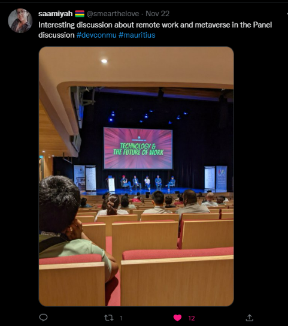
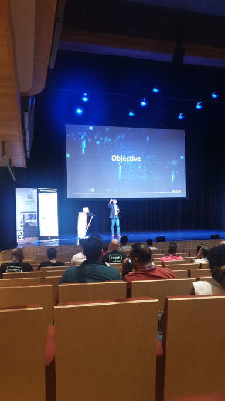
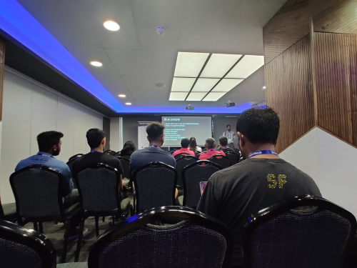
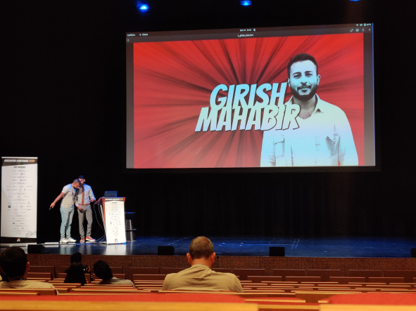

Mauritius Developers Conference 2022

This week, more than 900 tech enthusiasts descended on the city of Port Louis at [Caudan Arts Centre](https://caudanartscentre.com/) for the 7th Developers Conference. In case you are wondering what the Developers Conference is. Here is an [article](https://lexpress.mu/node/415580) written by [Ish Sookun](https://twitter.com/IshSookun) on L'express. 

Before we start talking about devcon, let's take a moment to appreciate the venue first. It was my first time being there for an event, and damn its magnificent. Unfortunately I did not take many photos but here is [tweet thread](https://twitter.com/AfriTheatreMag/status/1484796561884340225) I found on twitter. I can say I think it is absolutely remarkable. 

So, devcon over the course of 3 days, housing over 70+ sessions were able to welcome nearly 1000 attendees. The conference was free of charge for everyone. All that needed to be done was go on their [website](https://conference.mscc.mu/agenda) and register. One of the reason I like going to these conferences, is for the GOODIES. This year we got stickers, card holder, a super cute duck and a super cool t-shirt(Only the Grey one), as for the black t-shirt, I'm just showing off  😆, in case you're curious why I did that, well that was a [tweet](https://twitter.com/elonmusk/status/1587911540770222081) from the Elon Musk.  Oh did I mentioned that we also got free Wi-fi offered by Rogers Capital.

Picture by [Arshad Pooloo](https://twitter.com/ArshadPooloo/)

Unfortunately I missed the opening ceremony on the first day. There were some sessions I wanted to attend but couldn't.

"UNDERSTANDING THE UNDERLYING STACK OF LINUX CONTAINERS - IN JUST 5 MINS" by [Chittesh Sham](https://twitter.com/tesh1224). Super funny and downtoearth guy. His entrance was the hightlight of the session tbh. Okay so containers, while I'm still having troubles lately to understand containers, his talk was really helpful in some ways. Definitely going to make a post in the future once I get the grasp of it.

At 6pm, Happy Hour started which was sponsored by 2 companies (Spoon Consulting and forgot the second one). It was really fun, met my bestfriends after almost 1 year. Beer and wine were served alongside small snacks and music playing in the backgroud. Met [Nirvan Pagooah](https://twitter.com/nirvanpagooah), we had a really nice and long conversation. He explained to us about his career, about klanik. I can literally stay and listen to him talking for hours and still not get tired.

Here are some other sessions on the first day posted by [Saamiyah](https://twitter.com/smearthelove) and [Arshad Pooloo](https://twitter.com/ArshadPooloo/)

"Go:From Scratch to Prod" by [MUHAMMAD YUSUF ABDOOL SATAR](https://twitter.com/__fluxy__)

"Technology and The Future Of Work"

"Dugging Techniques For Uncertain Times" by [Saamiyah](https://twitter.com/smearthelove)

"The Digital Journey" by Sujit Woozageer from Swan.

Sadly, I missed the second day because of work but eventually made it to the final day. But theres is some pictures from other attendees. Thanks to [Saamiyah](https://twitter.com/smearthelove) and [Arshad Pooloo](https://twitter.com/ArshadPooloo/)
for allowing me to use their pictures.

"Putting AI into Action in Manufacturing" by Kendall Tang and Heman Mohabeer

"Modern Frontend Development with Vite.js" by [SANDEEP RAMGOLAM](https://twitter.com/__Sun__)

"BUILDING PRODUCTION-READY SWARM CLUSTERS ON DOCKER-CE" by ALAN JEAN

"Boosting your Web Traffic in 2022" by Vashin Soraballee and Vishwadev Bhundhoo

"Three.js" by [VIDUSH H. NAMAH](https://twitter.com/VHNamah). Really wanted to attend this one. I started learning about three.js about two years ago. Three.js is an open source Javascript library that is used to display 3D and 2D objects on the web browser. Cool right? Here is some mindblowing three.js website to can check out :

https://bruno-simon.com/
https://next.junni.co.jp/
https://www.kodeclubs.com/
https://stonewallforever.org/

"Securing and Managing Your Own Mail Server" by [Ish Sookun](https://twitter.com/IshSookun)
 

The third day was awesome with plenty of super interesting sessions. Starting with "PURPLE PEOPLE AT THE HEART OF TECH COMPANIES" by [Nirvan Pagooah](https://twitter.com/nirvanpagooah). Really glad I attended this session, learned a lot about the concept of the Red, Blue and Purple People.

Quick summary, Red people are the Techinical people for example: Developers, Testers, System Admin, Devops engineers. The blue people are the ones that handles the business and manage part of the company: HR for example. Also someone joked, blue people=the smurfs 😆 . Will now be calling HR people, the smurfs  😂 . Finaly the purple people, the heart of the company. Purple people are the people like (I'm sure you heard of them) [Elon Musk](https://twitter.com/elonmusk), [Sundar Pichai](https://twitter.com/sundarpichai), [Bill Gates](https://twitter.com/BillGates), amongst other. These person are called the purple people as not only they are good at technical stuff(Coding, etc), but they know how to handle the business as well. They understand how to manage and drive companies to sucess. While some may disagree, but I'm quite excited to know the future of Twitter since Elon Musk took over as the CEO. 

 

"AUTHENTICATING OPEN SOURCE CLOUD APPLICATIONS WITH LDAP" by [Ish Sookun](https://twitter.com/IshSookun). Another fasinating session where i got to expand my knowledge. He is also someone I can keep listening without getting bored. 
Last session I attended was "ENCRYPTION IN AWS" by Soodeshna Bappoo. Again another chance where I got to level up my AWS skills.

I took a little break and went got myself a Spicy Grand Chicken Meal at Mcdonald's ALONE. 

Some pictures from other talks taken by [Saamiyah](https://twitter.com/smearthelove)
"Types to the rescue" by [Renghen](https://twitter.com/renghenKornel)

"Imaginative Art For A Living" by [Jordan Bienvenue and Sibella Arlanda](https://twitter.com/UnkaiBuilder)

At around 2:30pm, LIGHTNING TALKS 2022 begun by [SANDEEP RAMGOLAM](https://twitter.com/__Sun__). It was really entertaining.

First Speaker was [Ish Sookun](https://twitter.com/IshSookun). He gave a talk about Linux Mirrors in Mauritius. He discussed about how it was made possible in the first place. You can read more about it on his blog [here](https://sysadmin-journal.com/ubuntu-mirror-in-mauritius/).

Followed by [Girish Mahabir](https://twitter.com/girishmahabir) who gave a small and quick talk about containers.

Then [Jeshta Bhoyedhur](https://twitter.com/jjeshta) talked about Web bundles. 

[Michael Jules](https://mgjules.dev/) gave us a quick overview on [Directus](https://directus.io/).

Okay, so now comes the fun part. [Priyeshan](https://twitter.com/BaphometPrichi) gave awe-inspiring demo on how to transform your boring pong game to another level. You can find a samll video I posted on twitter [here](https://twitter.com/sudo_gluck/status/1595741580203360258). 

Does it get even better than this you ask? HECK YES, [Chittesh Sham](https://twitter.com/tesh1224) came and literally everyone was blown away with the demo that he did. He created music using [Ableton](https://linktr.ee/ableton). It all came so fast, I didn't got time to hit on the record button. Definitely going to try using it and make my own music. Here is a quick [video](https://twitter.com/venusquicksilve/status/1595744169112264705) posted by [Nidhisha](https://twitter.com/venusquicksilve).

Last but not least was [SANDEEP RAMGOLAM](https://twitter.com/__Sun__). 

At 4pm was finally the Closing Ceremony, [Ish Sookun](https://twitter.com/IshSookun) and [Jochen Kirstätter](https://twitter.com/JKirstaetter) was the hosts. Started by thanking all the sponsers without whom it would not have been possible.

Someone from Providus came on Stage and start thowing balls to the crowd. Didier Adrien from Swan gave a small speech. Gifts were then given to some winners.

Forgot to mentioned, there was also a small competition on twitter; the one who shall tweet the most #DevConMu, wins a gift. Unfortunately I did not won, by I think I was among the top 10? The winner was [Arshad Pooloo](https://twitter.com/ArshadPooloo) with [77 tweets](https://twitter.com/chervinebhiwoo/status/1595740867004092416) who won a [Huawei Band 7](https://twitter.com/ArshadPooloo/status/1596011165599023104/photo/1). 

We also managed to get #DevconMu trend on Twitter in our Region. (Screenshot taken by [Nidhisha](https://twitter.com/venusquicksilve))

We also got a small tease for next year Developers Conference Theme which is......SPACE!! 

And that’s a wrap. It was a blast to be at Devcon this year! The event served as another reminder that there are a lot of amazing people and minds in Mauritius. As I get back home after what could only be described as a whirlwind of three days. Whether you're a student, a professional, a non-it person, devcon is a place to be to ramp up your knowledge on just different technologies. Maybe one day I could give a talk at the devcon? Maybe I could try at a smaller scale at one of our local meetups to build up my skills and confidence first. 

Cheers!

